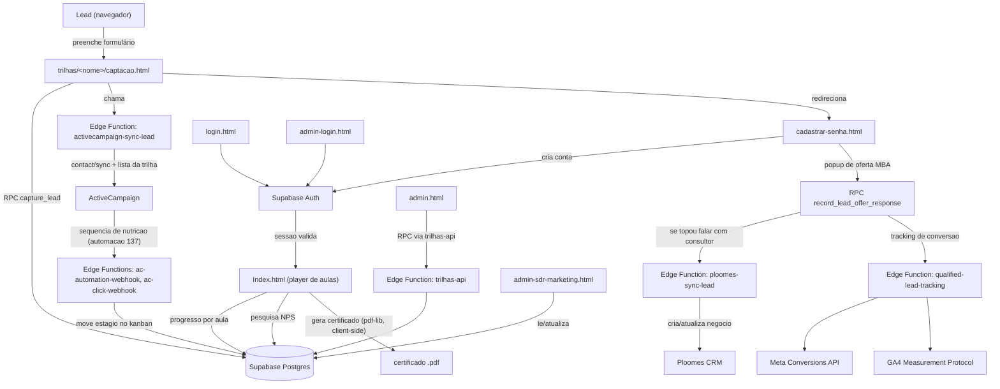

# Arquitetura

## Visão geral

## Componentes

### Frontend (estático, sem build)
Cada página é um HTML autocontido (CSS e JS inline na maior parte dos casos). Não há React/Vue nem bundler — isso é proposital, pra manter o deploy simples (qualquer alteração é só editar o HTML e dar push).

- `trilhas/<nome>/captacao.html` — uma por trilha, formulário de captação.
- `cadastrar-senha.html` — cria a conta e mostra o popup de oferta do MBA (o formato do popup varia por trilha — ver `currentTrailSlug()`/`updateTrailCopy()` no próprio arquivo).
- `Index.html` — player de aulas, dinâmico: carrega a lista de trilhas publicadas direto do banco (função `loadDynamicCourses()`), então funciona pra trilhas novas sem precisar alterar este arquivo — só é preciso alterar se a trilha nova tiver alguma regra especial de nome/popup (ver `normalizeTrailSlug()`).
- `admin.html`, `admin-login.html`, `admin-sdr-marketing.html` — painéis internos.

### Banco de dados (Supabase Postgres)
Schema principal em `supabase/*.sql` (não há migrations numeradas — os arquivos `.sql` na raiz de `supabase/` são aplicados manualmente via SQL Editor ou Management API). Tabelas centrais:
- `leads` — um registro por pessoa que preencheu algum formulário de captação.
- `trilhas`, `aulas`, `cursos` — conteúdo das trilhas (dinâmico, editável pelo painel admin).
- `user_lesson_progress` — progresso de aula por usuário autenticado.
- `sdr_contact_triggers`, `sdr_pipeline_stages`, `sdr_followup_tasks`, `sdr_followup_templates` — o CRM de SDR (Kanban com 3 "Situações" — A: intenção imediata de pós-graduação; B: concluiu a trilha; C: confirmou interesse no popup de oferta).
- `sdr_email_link_clicks` — clique em link de e-mail da automação de nutrição, usado pra pontuação de prioridade.
- `trilha_nps_respostas` — resposta da pesquisa de satisfação exibida antes do certificado.
- `admin_users` — quem tem acesso aos painéis admin.

### Edge Functions (Supabase, Deno)
| Função | O que faz |
|---|---|
| `activecampaign-sync-lead` | Sincroniza um lead com a lista certa do ActiveCampaign (uma lista por trilha) + campos customizados. Se o lead qualifica pra Situação A, também inscreve na lista-gatilho da automação de nutrição. |
| `ploomes-sync-lead` | Cria/atualiza o contato e o negócio (deal) do lead no Ploomes, no pipeline certo pra trilha. |
| `qualified-lead-tracking` | Envia eventos de conversão (Meta Conversions API, GA4) quando o lead confirma interesse no popup de oferta. |
| `ac-automation-webhook` | Recebida pelo ActiveCampaign depois de cada e-mail da automação de nutrição ser enviado — move o lead no Kanban e marca a etapa de nutrição correspondente. |
| `ac-click-webhook` | Recebida pelo ActiveCampaign quando o lead clica num link de e-mail — grava o clique pra pontuação de prioridade. |
| `trilhas-api` | CRUD de trilhas/aulas/cursos, usado pelo painel admin (`admin.html`). |
| `trilha-self-enroll` | Permite um usuário já logado se auto-inscrever numa trilha adicional. |
| `admin-user-manager` | Cria usuários admin e altera permissões, usado pelo painel admin. |
| `ploomes-check-commercial` | Verifica se um lead já está no funil comercial de vendas do Ploomes (pipeline diferente do funil de trilhas). |

**Possíveis pendências a verificar** (vi referências no código/configuração, mas não encontrei o código-fonte local — pode ter sido criada direto pelo painel do Supabase, ou removida e ainda referenciada em algum lugar):
- `ia-direito-sync-lead` — referenciada em `trilhas/gde/captacao.html`, mas sem pasta correspondente em `supabase/functions/`.
- `activecampaign-list-diagnostic` — mencionada em notas/histórico do projeto, verificar se ainda está implantada e se é necessária.

### Integrações externas
Ver tabela de integrações no `README.md`. Cada trilha tem sua própria lista no ActiveCampaign e, quando aplicável, seu próprio pipeline/estágio no Ploomes — os mapeamentos ficam nas constantes no topo de `activecampaign-sync-lead/index.ts` e `ploomes-sync-lead/index.ts`.

### Roteamento (Vercel)
`vercel.json` define rewrites de URL amigável (`/financas` → `/trilhas/financas/captacao.html`, etc.) e cache-control por tipo de arquivo. Qualquer trilha nova precisa de uma entrada aqui pra ter URL curta — sem isso, só funciona pelo caminho completo do arquivo.
